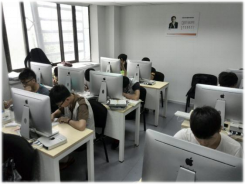
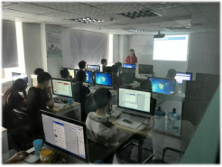
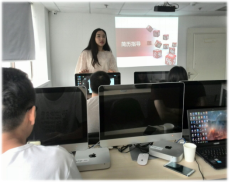
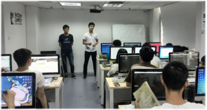

# 
 [**RED FLAG**](http://www.红旗学院.com)

## 1. 首页介绍
* **网络空间** —— 国家的第五疆城

## 2. 内院弟子
* **红旗学院** 实景学习氛围
	
	
* **红旗学院** 行业、企业分享

	 
* **红旗学院** 学长分享

	 

## 3. 外院弟子
红旗学院 首创网络安全人才私人职业服务体系：
响应习总书记关于网络安全人才特殊待遇的指示，以红旗学院为中心，创建专业的人才输送平台，打造“私人定制”级的就业服务体系，实现用人单位和学员的广泛接触和无缝对接，帮助红旗学院的学员实现三 年 收 入 破 30 万 ！

## 4. 红旗战队
红旗学院 独家：外院弟子—内院弟子—红旗战队 技术成长路线：
吸纳所有对信息安全抱有极大兴趣和学习热情的青年，成为红旗学院“外院弟子”在红旗学院内学习4个月，然后进入联盟各个企业的信息安全岗位进行实战历练；根据“外院弟子”各自的成长，不定期选拔、甄选成为红旗学院的“内院弟子”给予其莫大的机缘，传承“红旗学院”先锋技术；从“内院弟子”中挑选顶尖学员组成专业“红旗战队”有选择的参加国内外各种竞赛，使其在信息安全领域扬名立万！

 

> 中国（中关村）网络安全与信息化产业联盟
> -
> 项目实施：北京学邦世纪科技有限公司
> -
> 北京石景山区石景山路40号
> -
> 信安大厦六层A-C
> -
> WWW . 红旗学院 . COM
> -